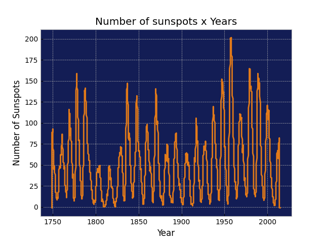

# Historical Sunspot Analysis: Mapping the Schwabe Cycle

## Description
This Python-based project processes long-term data from the Sunspot Index and Long-term Solar Observations (SILSO) to visualize solar activity trends over the years. By plotting the number of registered sunspots, the program reveals the rhythmic "heartbeat" of our star.

## Objective
To analyze historical solar records and identify the periodic oscillations of the Sun's magnetic activity, providing insights into long-term space weather patterns.

## Scientific Background
The Sun operates on a nearly constant ~11-year cycle, known as the Schwabe Cycle. This period is characterized by the oscillation between Solar Maximum (peak activity) and Solar Minimum (low activity). Approximately every 11 years, the Sun's magnetic poles flip. This massive magnetic reconfiguration leads to:
- Increased Sunspot count: Concentrated magnetic flux on the photosphere.
- Extreme Events: A higher frequency of Solar Flares and Coronal Mass Ejections (CMEs).
- Earth Impact: These phenomena drive space weather, making this analysis crucial for forecasting and protecting global satellite infrastructure and power grids.

The Sun follows an approximately 11 year activity cycle, but hemispheric dominance can shift over time.

## Methodology
- Data Acquisition: Parsing historical datasets from the SILSO database.
- Processing: Cleaning and organizing sunspot counts by yearly/monthly intervals using Python.
- Visualization: Generating time-series plots to highlight the peaks and valleys of solar cycles.

## Results
The generated plots clearly manifest the 11-year periodicity. By observing these historical peaks, we can contextualize our current position in Solar Cycle 25 and understand the scale of magnetic intensity compared to previous centuries.

## Visualization

## Technologies Used
- Python
- Matplotlib
- CSV data processing

